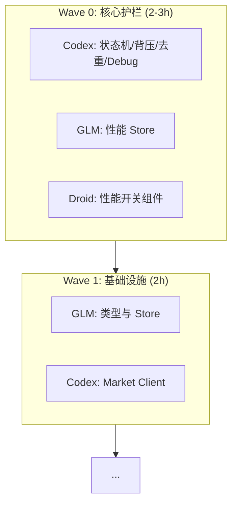

# 🎯 Epic: Frontend V3 - 三栏布局重构

> **状态**: ✅ 规划完成，待启动  
> **预估时间**: 10-12h（过夜任务）  
> **执行模式**: 4 Agent 协作

---

## 📁 目录结构

```
frontend-v3/
├── README.md                    # 本文件
├── glm/
│   ├── GLM-OVERNIGHT-GUIDE.md   # GLM 总指南
│   ├── L-000-performance-store.md
│   ├── L-001-install-deps.md
│   ├── L-002-types-chat.md
│   ├── L-003-types-market-panel.md
│   ├── L-004-stores.md
│   ├── L-005-sidebar.md
│   └── L-006-main-layout.md
├── codex/
│   ├── CODEX-OVERNIGHT-GUIDE.md # Codex 总指南
│   ├── C-000-connection-state-machine.md
│   ├── C-009-realtime-debug.md
│   ├── C-001-tick-buffer.md
│   ├── C-002-market-client.md
│   ├── C-003-streaming-chat.md
│   └── C-006-kline-panel.md
├── droid/
│   ├── DROID-OVERNIGHT-GUIDE.md
│   └── D-000-performance-mode-toggle.md
└── amp/
    └── TASKS.md
```

---

## 📚 全局参考文档

所有 Agent 执行前必读：

1. `tasks/FutureShop/frontend-architecture-guide.md` - 三栏布局、消息类型、面板架构
2. `tasks/FutureShop/agent-task-spec.md` - 验收标准、API 契约
3. `FRONTEND_REFACTOR_REVIEW.md` - Amp 评审（新增交互 + 15 优化项）

---

## 🤖 Agent 分工

| Agent | 任务数 | 预估 | 启动文件 |
|-------|--------|------|----------|
| 🔵 GLM | 16 | 7.5h | `glm/GLM-OVERNIGHT-GUIDE.md` |
| 🟢 Codex | 8 | 5.5h | `codex/CODEX-OVERNIGHT-GUIDE.md` |
| 🟠 Droid | 6 | 1.5h | `droid/TASKS.md` |
| 🟣 Amp | 4 | 2h | `amp/TASKS.md` |

---

## 📊 执行波次

> [!IMPORTANT]
> **Wave 0** 是 Oracle 评审要求的硬性护栏，必须在 Wave 1 启动前完成。



| 波次 | Agent | 核心任务 |
|------|-------|----------|
| **Wave 0** | 🟢 Codex | ConnectionStateMachine (W0-1), realtimeDebug (W0-4) |
| | 🔵 GLM | performance.store (W0-6) |
| | 🟠 Droid | PerformanceModeToggle (W0-5) |
| **Wave 1** | 🔵 GLM | L-001 ~ L-004 |
| | 🟢 Codex | C-001 ~ C-002 |
| **Wave 2** | 🔵 GLM | L-005 ~ L-012 |
| | 🟢 Codex | C-003 ~ C-005 |
| **Wave 3** | 🔵 GLM | L-013 ~ L-016 |
| | 🟢 Codex | C-006 ~ C-008 |
| **Wave 4** | 🟠 Droid | 响应式/设置面板/样式 |
| | 🟣 Amp | A-001 ~ A-002 (最终审查) |

---

## 📁 文件所有权表

为避免 Agent 并行执行冲突，请严格遵守以下所有权（非所有者对该文件仅限“只读”或“扩展请求”）：

| 目录/文件 | 所有者 (Owner) | 其他 Agent 权限 |
|-----------|----------------|----------------|
| `realtime/*` | 🟢 Codex | 只读 |
| `hooks/useStreaming*.ts` | 🟢 Codex | 只读 |
| `components/panels/KLinePanel.tsx` | 🟢 Codex | 只读 |
| `types/*` | 🔵 GLM | 🟢 Codex 可扩展 |
| `stores/*` | 🔵 GLM | 🟢 Codex 可扩展 market.store |
| `components/layout/*` | 🔵 GLM | 只读 |
| `components/chat/*` | 🔵 GLM | 🟢 Codex 可扩展卡片组件 |
| `styles/*` | 🟠 Droid | 只读 |

---

## 🚀 启动指令 (Copy & Paste)

### 🔵 GLM (布局与面板)
```text
请按照 `tasks/epics/frontend-v3/glm/GLM-OVERNIGHT-GUIDE.md` 构建前端三栏布局、类型、Store 和基础面板。开始每个任务前填写 `⏱️ 开始时间`，结束时填写 `✅ 结束时间`。遵守 `tasks/epics/frontend-v3/README.md` 中的文件所有权。
```

### 🟢 Codex (核心逻辑与实时层)
```text
请按照 `tasks/epics/frontend-v3/codex/CODEX-OVERNIGHT-GUIDE.md` 实现连接状态机、去重窗口、背压缓冲以及 K线面板。开始每个任务前填写 `⏱️ 开始时间`，结束时填写 `✅ 结束时间`。必须落实 `ORACLE_REVIEW.md` 中的 P0 护栏代码。
```

### 🟠 Droid (响应式与样式) —— **Wave 4 启动**
```text
请按照 `tasks/epics/frontend-v3/droid/DROID-OVERNIGHT-GUIDE.md` 进行响应式适配、设置面板实现及视觉微调。需与 GLM 完成的组件对接，并记录每个任务的时间。
```

### 🟣 Amp (验收专家) —— **Wave 4 终审**
```text
请按照 `tasks/epics/frontend-v3/amp/AMP-OVERNIGHT-GUIDE.md` 对整个 Epic 的代码质量和 Spec 合规性进行最终审查。记录 Review 时间。
```

---

## ✅ 完成标准

- [ ] `pnpm check` 通过
- [ ] `pnpm build` 成功
- [ ] 三栏布局正确显示
- [ ] Sidebar 可折叠
- [ ] 面板可拖拽调整
- [ ] 60fps 稳定性 >= 95%
