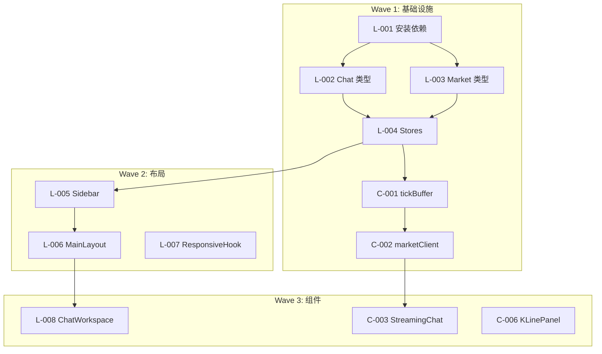

# 📋 Frontend V3 任务分配评审报告

> **评审日期**: 2026-01-30  
> **评审者**: Amp  
> **对照文档**: `docs/ai-collab/AI-COLLAB-PLAYBOOK.md`

---

## 📊 总体评价

| 维度 | 评分 | 说明 |
|------|------|------|
| 结构完整性 | ⭐⭐⭐⭐⭐ | Epic/Agent/Task 三层结构清晰 |
| 任务粒度 | ⭐⭐⭐⭐ | 每个任务 15-60min，符合"小步快跑" |
| 依赖管理 | ⭐⭐⭐⭐ | Wave 1-4 顺序正确，但缺可视化 |
| 测试覆盖 | ⭐⭐⭐ | Codex 有测试，GLM 缺失 |
| 协作规范 | ⭐⭐⭐⭐ | 有 ISSUES.md，缺进度同步 |
| 回滚机制 | ⭐⭐ | 无明确回滚指引 |

**总评**: 任务分配质量较高，符合 Playbook **80%** 的规范。

---

## ✅ 符合 Playbook 的优秀做法

| 做法 | 对应规则 | 评价 |
|------|----------|------|
| 按能力分配 Agent | §3.1 任务类型 → Agent 映射 | ✅ GLM 做大量 UI、Codex 做性能关键、Amp 审查 |
| 每个任务有独立文件 | §9.2 子任务模板 | ✅ L-001.md, C-001.md 格式清晰 |
| 两阶段审查 | §7.1 Spec 合规 → 代码质量 | ✅ Amp 任务明确分为 A-001 和 A-002 |
| 阻塞处理机制 | §8 遇阻即停 | ✅ 有 ISSUES.md 模板 |
| 必读文档列表 | §4 契约先行 | ✅ 每个 Agent Guide 都有必读文档 |
| 验收标准明确 | §9.2 子任务模板 | ✅ 每个任务都有 checklist |
| 波次执行 | §6 执行模式 | ✅ Wave 1-4 依赖关系清晰 |

---

## ⚠️ 需要改进的问题

### 1. 🔴 缺少 TDD 强制执行

**问题**: Playbook §1 要求 "TDD 强制：先写测试，再写实现"，但 GLM 任务中没有测试要求

**当前状态**:
- Codex 任务 ✅ 有测试要求（C-001 有完整测试代码）
- GLM 任务 ❌ 没有测试要求（16 个任务都没提测试）

**修复方案**: 在 `GLM-OVERNIGHT-GUIDE.md` 中添加：

```markdown
## 🧪 测试要求

以下任务需要创建单元测试：
- L-004 (Stores) → 测试 actions 和 selectors
- L-005 (Sidebar) → 测试折叠/展开状态
- L-007 (useResponsiveLayout) → 测试断点判断

测试文件位置：与源文件同目录下的 `__tests__/` 文件夹
```

---

### 2. 🔴 缺少 Git 提交规范

**问题**: Playbook §9.2 要求每步都有 `git commit`，但任务中没有提交指引

**修复方案**: 在每个任务的 "验证" 步骤后添加：

```markdown
### Step N: 提交

```bash
git add client/src/refactor_v2/xxx/
git commit -m "feat(v3): add xxx component"
```
```

**提交信息规范**:
- `feat(v3):` - 新功能
- `fix(v3):` - 修复
- `refactor(v3):` - 重构
- `test(v3):` - 测试

---

### 3. 🟡 Oracle 建议的组件未分配

**问题**: `FRONTEND_REFACTOR_REVIEW.md` 中 Oracle 建议的 4 个必须组件没有明确分配

| 组件 | 重要性 | 当前状态 | 建议分配 |
|------|--------|----------|----------|
| PerformanceModeToggle | 🔴 必须 | ❌ 未分配 | Droid D-004 附加 |
| ConnectionStatus | 🔴 必须 | ❌ 未分配 | Codex C-002 附加 |
| PanelErrorBoundary | 🔴 必须 | ❌ 未分配 | GLM L-014 附加 |
| Virtual List | 🔴 必须 | ✅ 已安装依赖 | GLM L-015 使用 |

**修复方案**: 更新对应任务文件，添加这些组件的实现要求。

---

### 4. 🟡 缺少进度同步机制

**问题**: Playbook §5.1 提到 `today.md` 用于今日待办，但任务中没有使用

**修复方案**: 创建 `PROGRESS.md`：

```markdown
# 📊 执行进度

## 🔵 GLM

| 任务 | 状态 | 完成时间 | 备注 |
|------|------|----------|------|
| L-001 | ⬜ | - | |
| L-002 | ⬜ | - | |
| ... | | | |

## 🟢 Codex

| 任务 | 状态 | 完成时间 | 备注 |
|------|------|----------|------|
| C-001 | ⬜ | - | |
| C-002 | ⬜ | - | |
| ... | | | |

## 状态说明
- ⬜ 未开始
- ⏳ 进行中
- ✅ 完成
- 🔴 阻塞
```

---

### 5. 🟡 缺少依赖关系可视化

**问题**: Wave 执行顺序只在 README 中文字描述，不直观

**修复方案**: 在 README.md 添加 Mermaid 图：



---

### 6. 🟡 Droid 角色定位与 Playbook 不一致

**问题**: 
- Playbook §2.1 定义 Droid 为 "移动端交互、跨端协调、轻量化任务"
- 但任务分配给了 "响应式测试、设置面板、样式调优"

**分析**: 当前分配合理（Droid 适合 UI/样式工作），建议：
1. 在任务文件中说明这是 "扩展使用"
2. 或更新 Playbook 中 Droid 的角色描述

---

### 7. 🟢 建议添加：回滚指南

**问题**: 如果过夜任务执行失败，没有回滚指引

**修复方案**: 在 README.md 添加：

```markdown
## 🔄 回滚方案

如果过夜任务导致大量问题：

### 方案 A: 硬回滚
```bash
git log --oneline  # 找到任务开始前的 commit
git reset --hard <commit-hash>
```

### 方案 B: 保留修改，创建问题分支
```bash
git checkout -b fix/frontend-v3-issues
# 在新分支上修复问题
```

### 方案 C: 选择性回滚
```bash
git revert <problem-commit>  # 只回滚有问题的提交
```
```

---

## ✅ 立即修复清单

### 🔴 必须修复 (发任务前)

- [ ] **GLM-OVERNIGHT-GUIDE.md** 添加测试要求
  - L-004 (Stores) 测试
  - L-005 (Sidebar) 测试
  - L-007 (useResponsiveLayout) 测试

- [ ] **每个任务文件** 添加 git commit 步骤

- [ ] **C-002-market-client.md** 添加 ConnectionStatus 组件

- [ ] **L-014-stock-workspace.md** 添加 PanelErrorBoundary

- [ ] **D-003-style-refinement.md** 添加 PerformanceModeToggle

- [ ] 创建 **PROGRESS.md** 进度追踪模板

### 🟡 建议修复

- [ ] README.md 添加 Mermaid 依赖图
- [ ] README.md 添加回滚指南
- [ ] 更新 AI-COLLAB-PLAYBOOK 中 Droid 角色描述

---

## 📁 需要更新的文件清单

| 文件 | 更新内容 |
|------|----------|
| `glm/GLM-OVERNIGHT-GUIDE.md` | 添加测试要求章节 |
| `glm/L-004-stores.md` | 添加测试步骤 + git commit |
| `glm/L-005-sidebar.md` | 添加测试步骤 + git commit |
| `glm/L-007-responsive-hook.md` | 添加测试步骤 + git commit |
| `glm/L-014-stock-workspace.md` | 添加 PanelErrorBoundary |
| `codex/C-002-market-client.md` | 添加 ConnectionStatus |
| `droid/D-003-style-refinement.md` | 添加 PerformanceModeToggle |
| `README.md` | 添加依赖图 + 回滚指南 |
| `PROGRESS.md` | 新建进度追踪文件 |

---

## 🚀 修复后的任务统计

| Agent | 原任务数 | 新增项 | 总任务量 |
|-------|---------|--------|----------|
| 🔵 GLM | 16 | +3 测试 +1 组件 | 16 (+附加) |
| 🟢 Codex | 8 | +1 组件 | 8 (+附加) |
| 🟠 Droid | 6 | +1 组件 | 6 (+附加) |
| 🟣 Amp | 4 | - | 4 |

---

**评审状态**: ✅ 完成  
**下一步**: 按上述清单修复任务文件后即可启动
