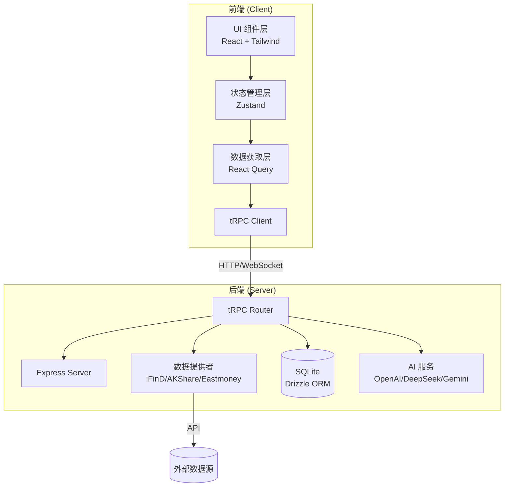
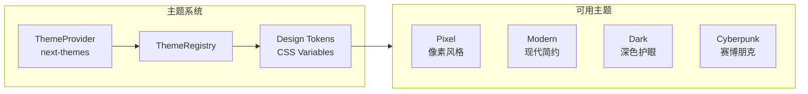
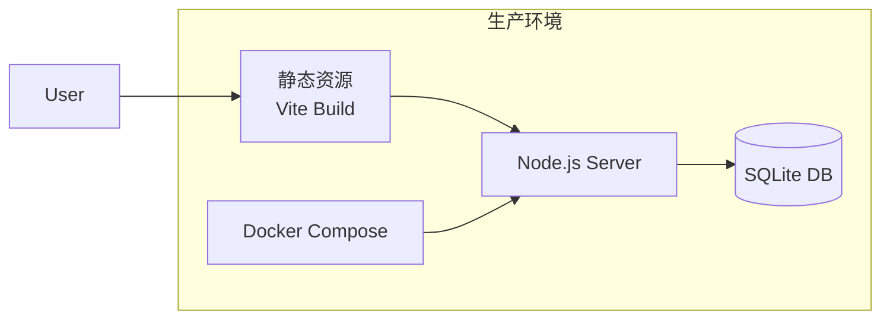

# DragonFly 系统架构文档

> 本文档描述 DragonFly 的整体架构设计，帮助开发者理解系统组成和数据流转。

---

## 🏗 系统架构概览



---

## 📁 模块架构

### 前端架构

```
client/src/
├── refactor_v2/          # 新版 UI 组件 (v2)
│   ├── components/       # 通用组件
│   ├── hooks/            # 自定义 Hooks
│   ├── stores/           # Zustand 状态管理
│   └── types/            # TypeScript 类型定义
├── lib/                  # 工具函数
├── index.css             # 全局样式
└── main.tsx              # 应用入口
```

**核心设计原则：**

- **组件职责分离**：布局组件只处理布局，业务组件只处理业务
- **状态集中管理**：使用 Zustand 管理全局状态
- **类型安全**：前后端共享类型定义

### 后端架构

```
server/
├── _core/                # 核心模块
│   ├── index.ts          # 服务入口
│   ├── trpc.ts           # tRPC 初始化
│   └── express.ts        # Express 配置
├── routers/              # tRPC 路由
│   ├── market.ts         # 行情数据接口
│   ├── stock.ts          # 股票相关接口
│   ├── ai.ts             # AI 对话接口
│   └── watchlist.ts      # 自选股接口
├── ai/                   # AI 服务封装
├── scripts/              # 分析和回测脚本
└── db.ts                 # 数据库连接
```

**核心设计原则：**

- **类型安全 API**：使用 tRPC 实现端到端类型安全
- **多数据源容错**：iFinD/AKShare/Eastmoney 自动切换
- **模块化路由**：每个领域独立的 tRPC router

---

## 🔄 数据流

### 行情数据流

```
用户操作 (选择股票)
    ↓
Zustand Store (更新当前 symbol)
    ↓
React Query (自动触发请求)
    ↓
tRPC Client → tRPC Server
    ↓
数据提供者 (iFinD/AKShare/Eastmoney)
    ↓
外部数据源
    ↓
数据缓存 (React Query)
    ↓
UI 更新 (K 线图表、价格显示)
```

### AI 对话流

```
用户输入问题
    ↓
Chat Store (添加消息)
    ↓
tRPC AI Router
    ↓
AI Provider (OpenAI/DeepSeek/Gemini/GLM)
    ↓
流式响应 (Streaming)
    ↓
UI 实时显示 (Markdown 渲染)
```

---

## 🎨 主题系统架构



**主题切换机制：**

1. `ThemeProvider` 提供主题上下文
2. `ThemeRegistry` 注册所有可用主题
3. 主题通过 CSS Variables 注入设计 Token
4. 组件使用 `cn()` 工具函数根据主题应用样式

---

## 📊 核心数据结构

### 股票数据结构

```typescript
interface Stock {
  symbol: string; // 股票代码 (如 "000001.SZ")
  name: string; // 股票名称
  price: number; // 当前价格
  change: number; // 涨跌额
  changePercent: number; // 涨跌幅
  volume: number; // 成交量
  turnover: number; // 成交额
}
```

### K线数据结构

```typescript
interface KLineData {
  time: number; // 时间戳
  open: number; // 开盘价
  high: number; // 最高价
  low: number; // 最低价
  close: number; // 收盘价
  volume: number; // 成交量
}
```

### 对话消息结构

```typescript
interface ChatMessage {
  id: string;
  role: "user" | "assistant" | "system";
  content: string;
  timestamp: number;
  model?: string; // 使用的 AI 模型
  metadata?: {
    tools?: string[]; // 调用的工具
    latency?: number; // 响应延迟
  };
}
```

---

## 🔌 外部集成

### 数据源集成

| 数据源               | 类型     | 用途             | 优先级 |
| -------------------- | -------- | ---------------- | ------ |
| iFinD (同花顺)       | 专业数据 | K线、基本面      | P1     |
| AKShare              | 开源量化 | 实时行情、资金流 | P2     |
| Eastmoney (东方财富) | 免费数据 | 新闻、情绪       | P3     |

### AI 模型集成

| 提供商   | 模型        | 用途     |
| -------- | ----------- | -------- |
| OpenAI   | GPT-4o      | 复杂分析 |
| DeepSeek | DeepSeek-V3 | 中文优化 |
| Gemini   | Gemini Pro  | 多模态   |
| GLM      | GLM-4       | 国内合规 |

---

## 🚀 部署架构



**部署组件：**

- **前端**: Vite 构建的静态资源
- **后端**: Node.js + Express + tRPC
- **数据库**: SQLite (Drizzle ORM)
- **数据服务**: Docker 运行的 AKShare 服务 (可选)

---

## 📚 相关文档

- [重构设计文档](./architecture/DRAGONFLY-REFACTOR.md) - 详细重构计划
- [AI 协作手册](./ai-collab/AI-COLLAB-PLAYBOOK.md) - 多 Agent 协作规范
- [项目 README](../README.md) - 快速开始指南
