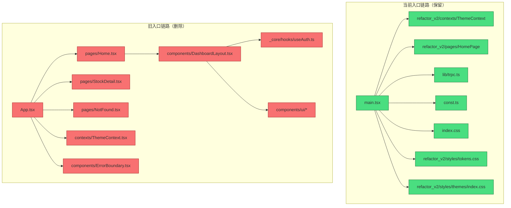

# 前端代码清理分析报告

**分析日期**: 2026-01-26  
**分析工具**: Oracle + Amp  
**项目**: DragonFly

---

## 一、项目现状分析

### 1.1 当前前端架构

项目存在**两套前端代码**：

| 版本 | 入口 | 路由方案 | 状态 |
|------|------|----------|------|
| 旧版 | `client/src/App.tsx` | wouter | ❌ 未使用 |
| 新版 | `client/src/refactor_v2/` | 单页面（暂无路由） | ✅ 正在使用 |

### 1.2 入口文件分析

**`client/src/main.tsx`（当前入口）**：

```tsx
// 使用的是 refactor_v2 的组件
import { ThemeProvider } from "@/refactor_v2/contexts/ThemeContext";
import { HomePage } from "@/refactor_v2/pages/HomePage";

// 引用的样式
import "@/refactor_v2/styles/tokens.css";
import "@/refactor_v2/styles/themes/index.css";
import "./index.css";

// 渲染新版前端
createRoot(document.getElementById("root")!).render(
  <trpc.Provider client={trpcClient} queryClient={queryClient}>
    <QueryClientProvider client={queryClient}>
      <ThemeProvider>
        <HomePage />  // ← 新版页面
      </ThemeProvider>
    </QueryClientProvider>
  </trpc.Provider>
);
```

**关键发现**：
- `main.tsx` **没有**引用旧的 `App.tsx`
- `main.tsx` **没有**引用旧的 `pages/`、`components/`、`contexts/`、`hooks/` 目录
- 旧的 wouter 路由系统完全未被加载

### 1.3 依赖引用分析

通过 Grep 搜索确认，`refactor_v2` 目录内：

| 搜索模式 | 结果 |
|----------|------|
| `@/components` | ❌ 无引用 |
| `@/pages` | ❌ 无引用 |
| `@/hooks` | ❌ 无引用 |
| `@/contexts` | ❌ 无引用 |
| `@/_core` | ❌ 无引用 |
| `@/lib/utils` | ❌ 无引用 |
| `wouter` | ❌ 无引用 |

**结论**：`refactor_v2` 是完全独立的，不依赖任何旧前端代码。

---

## 二、目录结构分析

### 2.1 client/src/ 当前结构

```
client/src/
├── __dev__/              # 🔴 可删除 - 开发用组件展示
├── _core/                # 🔴 可删除 - 旧的核心模块
├── components/           # 🔴 可删除 - 旧组件库
│   ├── ai/
│   ├── layout/
│   ├── market/
│   ├── stock/
│   ├── ui/               # shadcn/ui 组件（旧版）
│   └── *.tsx
├── contexts/             # 🔴 可删除 - 旧的 Context
├── hooks/                # 🔴 可删除 - 旧的 Hooks
├── lib/                  # 🟡 部分保留
│   ├── trpc.ts           # ✅ 保留 - main.tsx 依赖
│   └── utils.ts          # 🔴 可删除 - refactor_v2 不使用
├── pages/                # 🔴 可删除 - 旧页面
├── refactor_v2/          # ✅ 保留 - 新前端代码
├── App.tsx               # 🔴 可删除 - 旧入口
├── const.ts              # ✅ 保留 - main.tsx 依赖
├── index.css             # ✅ 保留 - main.tsx 依赖
└── main.tsx              # ✅ 保留 - 应用入口
```

### 2.2 旧代码详细清单

#### `client/src/App.tsx`（旧入口）

```tsx
// 使用 wouter 路由
import { Route, Switch } from "wouter";
import Home from "./pages/Home";
import StockDetail from "./pages/StockDetail";
import NotFound from "./pages/NotFound";

// 这个 Router 不再被 main.tsx 使用
function Router() {
  return (
    <Switch>
      <Route path={"/"} component={Home} />
      <Route path={"/stocks/:code"} component={StockDetail} />
      <Route path={"/404"} component={NotFound} />
      <Route component={NotFound} />
    </Switch>
  );
}
```

#### `client/src/pages/`（旧页面）

| 文件 | 说明 | 状态 |
|------|------|------|
| `Home.tsx` | 旧首页（虽然内部用了 refactor_v2 组件，但页面本身是旧路由的） | 可删除 |
| `StockDetail.tsx` | 股票详情页 | 可删除 |
| `NotFound.tsx` | 404 页面 | 可删除 |

#### `client/src/components/`（旧组件库）

```
components/
├── ai/                   # AI 相关组件
├── layout/               # 布局组件
├── market/               # 市场相关组件
├── stock/                # 股票相关组件
├── ui/                   # shadcn/ui 基础组件
├── AIChatBox.tsx
├── DashboardLayout.tsx
├── DashboardLayoutSkeleton.tsx
├── ErrorBoundary.tsx
├── ManusDialog.tsx
├── Map.tsx
├── PresetPrompts.tsx
└── ThemeToggle.tsx
```

#### `client/src/contexts/`（旧 Context）

- `ThemeContext.tsx` - 旧版主题 Context（refactor_v2 有自己的版本）

#### `client/src/hooks/`（旧 Hooks）

- 各种自定义 hooks，服务于旧组件

#### `client/src/_core/`（旧核心模块）

- `hooks/useAuth.ts` - 认证 hook（被旧 DashboardLayout 使用）

#### `client/src/__dev__/`（开发工具）

- `ComponentShowcase.tsx` - 开发用组件展示（57KB）
- `DevRoutes.tsx` - 开发路由

---

## 三、根目录文件分析

### 3.1 可删除的文件

| 文件/目录 | 大小 | 说明 | 建议 |
|-----------|------|------|------|
| `grok-detailed-output.md` | - | AI 输出日志 | 删除 |
| `grok-changcheng-output.md` | - | AI 输出日志 | 删除 |
| `CLEANUP-TRACKER.md` | - | 清理进度追踪 | 删除（任务已完成） |
| `CLEANUP-SUMMARY.md` | - | 清理总结 | 可删除或归档 |
| `archives/` | ~68KB | 旧代码存档 | 确认后删除 |
| `dist/` | - | 构建产物 | 删除（可重新生成） |
| `patches/wouter@3.7.1.patch` | - | wouter 补丁 | 删除（如移除 wouter） |

### 3.2 应保留的文件

| 文件/目录 | 说明 |
|-----------|------|
| `docs/` | 项目文档 |
| `server/` | 后端代码 |
| `shared/` | 共享类型/工具 |
| `scripts/` | 脚本工具 |
| `drizzle/` | 数据库迁移 |
| `data/` | 数据文件 |
| `tools/` | 工具脚本 |
| `README.md` | 项目说明 |
| `MIGRATION.md` | 迁移文档 |
| `CONTRIBUTING.md` | 贡献指南 |

---

## 四、依赖包分析

### 4.1 可能需要移除的依赖

删除旧前端代码后，以下依赖可能不再需要：

| 依赖 | 版本 | 原因 | 验证方法 |
|------|------|------|----------|
| `wouter` | ^3.3.5 | 旧路由库 | `grep -r "wouter" client/src/` |
| `embla-carousel-react` | ^8.6.0 | 轮播组件 | 检查 refactor_v2 是否使用 |
| `vaul` | ^1.1.2 | Drawer 组件 | 检查 refactor_v2 是否使用 |
| `react-dnd` | ^16.0.1 | 拖拽功能 | 检查 refactor_v2 是否使用 |
| `react-dnd-html5-backend` | ^16.0.1 | 拖拽后端 | 检查 refactor_v2 是否使用 |
| `@types/google.maps` | ^3.58.1 | 地图类型 | 如果 Map.tsx 被删除 |

### 4.2 Radix UI 组件使用情况

当前安装了大量 Radix UI 组件，删除旧 `components/ui/` 后需要检查哪些仍被 refactor_v2 使用：

```
@radix-ui/react-accordion
@radix-ui/react-alert-dialog
@radix-ui/react-aspect-ratio
@radix-ui/react-avatar
@radix-ui/react-checkbox
@radix-ui/react-collapsible
@radix-ui/react-context-menu
@radix-ui/react-dialog
@radix-ui/react-dropdown-menu
@radix-ui/react-hover-card
@radix-ui/react-label
@radix-ui/react-menubar
@radix-ui/react-navigation-menu
@radix-ui/react-popover
@radix-ui/react-progress
@radix-ui/react-radio-group
@radix-ui/react-scroll-area
@radix-ui/react-select
@radix-ui/react-separator
@radix-ui/react-slider
@radix-ui/react-slot
@radix-ui/react-switch
@radix-ui/react-tabs
@radix-ui/react-toggle
@radix-ui/react-toggle-group
@radix-ui/react-tooltip
```

**建议**：删除代码后，运行依赖审计脚本确认哪些可以移除。

---

## 五、删除清单

### 5.1 ✅ 安全删除（旧前端代码）

**优先级 P0 - 必须删除**

```bash
# 旧入口
rm client/src/App.tsx

# 旧页面
rm -rf client/src/pages

# 旧组件
rm -rf client/src/components

# 旧 Context
rm -rf client/src/contexts

# 旧 Hooks
rm -rf client/src/hooks

# 旧核心模块
rm -rf client/src/_core

# 开发工具
rm -rf client/src/__dev__

# 旧工具函数（确认 refactor_v2 不使用后）
rm client/src/lib/utils.ts
```

### 5.2 🟨 可选删除（根目录杂项）

**优先级 P1 - 建议删除**

```bash
# AI 输出日志
rm grok-detailed-output.md
rm grok-changcheng-output.md

# 已完成的清理文档
rm CLEANUP-TRACKER.md
rm CLEANUP-SUMMARY.md

# 构建产物
rm -rf dist

# 旧代码存档
rm -rf archives
```

### 5.3 🟦 后续清理（依赖移除）

**优先级 P2 - 验证后删除**

```bash
# 移除 wouter（确认无引用后）
pnpm remove wouter

# 移除 wouter 补丁
rm patches/wouter@3.7.1.patch

# 更新 package.json 移除 patchedDependencies
```

---

## 六、保留清单

### 6.1 必须保留的前端文件

| 路径 | 原因 |
|------|------|
| `client/src/main.tsx` | 应用入口 |
| `client/src/const.ts` | main.tsx 引用的 getLoginUrl |
| `client/src/lib/trpc.ts` | main.tsx 依赖的 TRPC 客户端 |
| `client/src/index.css` | main.tsx 引用的全局样式 |
| `client/src/refactor_v2/` | 新前端代码（全部保留） |
| `client/index.html` | HTML 入口 |
| `client/public/` | 静态资源 |

### 6.2 必须保留的共享/后端

| 路径 | 原因 |
|------|------|
| `shared/` | refactor_v2 引用 @shared/* |
| `server/` | 后端代码 |
| `drizzle/` | 数据库迁移 |

---

## 七、风险评估

### 7.1 风险矩阵

| 风险 | 概率 | 影响 | 缓解措施 |
|------|------|------|----------|
| 删除被引用的文件 | 低 | 高 | 删除后运行 `pnpm check` 验证 |
| 团队需要回滚旧代码 | 低 | 中 | 创建备份标签 `before-remove-legacy-frontend` |
| 遗漏清理依赖 | 中 | 低 | 删除后运行依赖审计 |
| 构建失败 | 低 | 高 | 删除后运行 `pnpm build` 验证 |

### 7.2 验证步骤

```bash
# 1. TypeScript 类型检查
pnpm check

# 2. 构建测试
pnpm build

# 3. 启动开发服务器
pnpm dev

# 4. 手动测试清单
# - [ ] 页面正常渲染
# - [ ] API 调用正常
# - [ ] 主题切换正常
# - [ ] 登录/登出正常
```

### 7.3 回退方案

```bash
# 方法 1：回退整个删除操作
git checkout before-remove-legacy-frontend

# 方法 2：恢复特定目录
git checkout before-remove-legacy-frontend -- client/src/components/

# 方法 3：回退最后一次提交
git revert HEAD
```

---

## 八、执行步骤

### 8.1 准备工作

```bash
# 1. 确保工作区干净
git status

# 2. 拉取最新代码
git pull origin main

# 3. 创建备份标签
git tag before-remove-legacy-frontend

# 4. 创建清理分支
git checkout -b chore/remove-legacy-frontend
```

### 8.2 执行删除

```bash
# 阶段 1：删除旧前端代码
rm client/src/App.tsx
rm -rf client/src/pages
rm -rf client/src/components
rm -rf client/src/contexts
rm -rf client/src/hooks
rm -rf client/src/_core
rm -rf client/src/__dev__
rm client/src/lib/utils.ts

# 阶段 2：删除根目录杂项
rm grok-detailed-output.md
rm grok-changcheng-output.md
rm CLEANUP-TRACKER.md
rm CLEANUP-SUMMARY.md
rm -rf dist
rm -rf archives
```

### 8.3 验证

```bash
# TypeScript 检查
pnpm check

# 构建
pnpm build

# 开发服务器
pnpm dev
```

### 8.4 提交

```bash
git add -A
git commit -m "chore: remove legacy frontend code

Removed:
- Old wouter-based App.tsx and routing
- Old pages/ directory (Home, StockDetail, NotFound)
- Old components/ directory (ui, stock, market, ai, layout)
- Old contexts/ and hooks/ directories
- Old _core/ and __dev__/ directories
- Cleanup tracking documents
- Archives and dist directories

Kept:
- refactor_v2/ as the new frontend
- main.tsx, const.ts, lib/trpc.ts, index.css

BREAKING CHANGE: Legacy frontend removed"

git push -u origin chore/remove-legacy-frontend
```

### 8.5 后续优化

```bash
# 1. 检查 wouter 是否还被使用
grep -r "wouter" client/src/
# 如果无结果，移除
pnpm remove wouter
rm patches/wouter@3.7.1.patch

# 2. 审计 Radix UI 使用情况
# 创建脚本检查哪些组件被 refactor_v2 使用

# 3. 移除未使用的依赖
pnpm prune
```

---

## 九、清理后的目录结构

```
client/src/
├── lib/
│   └── trpc.ts           # TRPC 客户端
├── refactor_v2/          # 新前端代码
│   ├── api/
│   ├── components/
│   ├── constants/
│   ├── contexts/
│   ├── hooks/
│   ├── pages/
│   ├── stores/
│   ├── styles/
│   ├── themes/
│   ├── types/
│   ├── App.tsx
│   └── REFACTOR-STATUS.md
├── const.ts              # 常量定义
├── index.css             # 全局样式
└── main.tsx              # 应用入口
```

---

## 十、预期收益

### 10.1 代码量减少

| 项目 | 删除前 | 删除后 | 减少 |
|------|--------|--------|------|
| `client/src/` 文件数 | ~80+ | ~50 | ~30 |
| 旧组件 | ~40 | 0 | ~40 |
| 旧页面 | 3 | 0 | 3 |

### 10.2 其他收益

- ✅ 项目结构更清晰
- ✅ 新人入职更容易理解
- ✅ 构建时间减少
- ✅ 依赖更精简
- ✅ 维护成本降低

---

## 附录：文件依赖图



---

---

## 十一、Git 版本控制最佳实践

### 11.1 文件分类原则

| 类型 | ✅ 应该上传 Git | ❌ 不应该上传 Git |
|------|----------------|------------------|
| **测试文件** | 正式单元/集成测试 (`__tests__/`) | 临时实验脚本 (`experiments/`) |
| **文档** | 架构、API、贡献指南、README | 日志、AI 输出、临时报告 |
| **任务** | Epic/需求文档、进行中的任务 | 已完成的任务、每日进度追踪 |
| **数据** | Schema、迁移脚本 | 用户数据、会话数据、缓存 |
| **配置** | 示例配置 (`.env.example`) | 实际配置 (`.env`) |

### 11.2 当前项目问题分析

#### 问题 1：实验代码在 Git 中

```
server/experiments/           # ❌ 不应该在 Git 中
├── ai_agent_20_stocks_optimized_test.ts
├── ai_agent_mini_test.ts
├── ai_agent_quick_test.ts
├── ai_agent_small_test.ts
├── test_basic_agent.ts
├── test_detailed_responses.ts
├── test_launch_gain.ts
└── test_smart_agent.ts
```

**问题**：这些是临时实验脚本，已被 `tsconfig.json` 排除编译，但仍在 Git 版本控制中。

**建议**：
- 方案 A：添加到 `.gitignore` 并从 Git 移除
- 方案 B：如果有价值，整理成正式测试移到 `__tests__/`

#### 问题 2：AI 输出日志在 Git 中

```
grok-detailed-output.md       # ❌ 临时 AI 输出
grok-changcheng-output.md     # ❌ 临时 AI 输出
```

**建议**：删除并添加到 `.gitignore`

#### 问题 3：已完成的清理文档

```
CLEANUP-SUMMARY.md            # ❌ 任务已完成，可归档
CLEANUP-TRACKER.md            # ❌ 任务已完成，可归档
```

**建议**：删除或移到 `docs/archive/`

### 11.3 测试文件最佳实践

#### ✅ 正式测试（应该上传 Git）

```
server/__tests__/
├── unit/                     # 单元测试
│   ├── auth.logout.test.ts
│   ├── eastmoney.test.ts
│   ├── grok-api.test.ts
│   ├── stocks.test.ts
│   └── watchlist.test.ts
├── integration/              # 集成测试
│   ├── api_connection.test.ts
│   ├── indicators.test.ts
│   └── ...
└── ai_agents/                # AI Agent 测试
    ├── 100_stocks_final.test.ts
    └── ...
```

**特征**：
- 命名规范：`*.test.ts` 或 `*.spec.ts`
- 可重复运行
- 有断言和预期结果
- CI/CD 会执行

#### ❌ 实验脚本（不应该上传 Git）

```
server/experiments/           # 临时实验
├── test_basic_agent.ts       # 一次性测试
├── ai_agent_mini_test.ts     # 性能实验
└── ...
```

**特征**：
- 命名不规范
- 需要手动运行
- 可能包含硬编码数据
- 不在 CI/CD 中执行

### 11.4 文档分类最佳实践

#### ✅ 应该上传 Git 的文档

| 目录/文件 | 说明 |
|-----------|------|
| `README.md` | 项目说明 |
| `CONTRIBUTING.md` | 贡献指南 |
| `MIGRATION.md` | 迁移指南 |
| `docs/architecture/` | 架构设计文档 |
| `docs/api/` | API 文档 |
| `docs/ai-collab/AGENTS.md` | AI 协作规范 |
| `docs/ai-collab/AI-COLLAB-PLAYBOOK.md` | AI 协作手册 |
| `tasks/epics/` | 需求/Epic 文档 |
| `tasks/README.md` | 任务管理说明 |

#### ❌ 不应该上传 Git 的文档

| 目录/文件 | 说明 | 处理方式 |
|-----------|------|----------|
| `docs/logs/` | 运行日志 | 已在 .gitignore ✅ |
| `docs/reports/` | 临时报告 | 已在 .gitignore ✅ |
| `grok-*.md` | AI 输出 | 需添加到 .gitignore |
| `*-output.md` | 临时输出 | 需添加到 .gitignore |
| `CLEANUP-*.md` | 已完成任务 | 删除或归档 |
| `tasks/archive/` | 已完成任务 | 已在 .gitignore ✅ |

### 11.5 推荐的 .gitignore 更新

在现有 `.gitignore` 基础上添加：

```gitignore
# ===========================================
# 实验性代码
# ===========================================

# 实验脚本（不需要版本控制）
server/experiments/

# ===========================================
# 临时文档和输出
# ===========================================

# AI 临时输出
grok-*.md
*-output.md
*-detailed-output.md

# 已完成的清理/任务文档
CLEANUP-*.md

# 任务归档
tasks/archive/
tasks/**/DONE-*.md
tasks/**/COMPLETED-*.md

# ===========================================
# 归档目录
# ===========================================

# 旧代码存档（如需保留历史用 git tag）
archives/

# 文档归档
docs/archive/
```

### 11.6 执行命令

```bash
# 1. 更新 .gitignore
# （按上面的内容更新）

# 2. 从 Git 移除但保留本地文件
git rm -r --cached server/experiments/
git rm --cached grok-detailed-output.md
git rm --cached grok-changcheng-output.md
git rm --cached CLEANUP-SUMMARY.md
git rm --cached CLEANUP-TRACKER.md
git rm -r --cached archives/

# 3. 提交更改
git add .gitignore
git commit -m "chore: update .gitignore to exclude experiments and temp docs"

# 4. 如果要彻底删除这些文件
rm -rf server/experiments/
rm grok-detailed-output.md
rm grok-changcheng-output.md
rm CLEANUP-SUMMARY.md
rm CLEANUP-TRACKER.md
rm -rf archives/
```

### 11.7 目录结构最佳实践

#### 推荐的项目结构

```
DragonFly/
├── .github/                  # GitHub 配置（CI/CD、模板）
├── client/                   # 前端代码
│   └── src/
│       └── refactor_v2/      # 新前端（唯一）
├── server/                   # 后端代码
│   ├── __tests__/            # ✅ 正式测试（上传 Git）
│   ├── _core/                # 核心模块
│   ├── routers/              # API 路由
│   └── ...
├── shared/                   # 前后端共享代码
├── docs/                     # 文档（只保留重要的）
│   ├── architecture/         # 架构文档
│   ├── api/                  # API 文档
│   └── ai-collab/            # AI 协作文档
├── tasks/                    # 任务管理
│   └── epics/                # Epic/需求文档
├── scripts/                  # 工具脚本
├── drizzle/                  # 数据库迁移
├── .gitignore
├── README.md
├── CONTRIBUTING.md
└── package.json
```

#### 不应该出现在 Git 中的

```
❌ server/experiments/        # 实验代码
❌ archives/                   # 旧代码存档
❌ docs/logs/                  # 日志
❌ docs/reports/               # 临时报告
❌ tasks/archive/              # 已完成任务
❌ grok-*.md                   # AI 输出
❌ CLEANUP-*.md                # 临时清理文档
❌ dist/                       # 构建产物
❌ node_modules/               # 依赖
```

### 11.8 Git 历史保留建议

如果某些代码/文档有历史价值但不想保留在主分支：

```bash
# 方法 1：创建标签保留历史快照
git tag archive/experiments-2026-01-26

# 方法 2：创建归档分支
git checkout -b archive/legacy-frontend
git checkout main

# 方法 3：使用 Git LFS 存储大文件
git lfs track "*.pdf"
git lfs track "docs/reports/*.md"
```

### 11.9 CI/CD 建议

在 `.github/workflows/` 中确保：

```yaml
# 只对正式测试运行 CI
test:
  runs-on: ubuntu-latest
  steps:
    - run: pnpm test
    # 只运行 __tests__/ 下的测试
    # experiments/ 已被 tsconfig 排除，不会被编译
```

---

## 十二、完整清理清单汇总

### 12.1 前端代码清理

| 操作 | 路径 | 说明 |
|------|------|------|
| 删除 | `client/src/App.tsx` | 旧入口 |
| 删除 | `client/src/pages/` | 旧页面 |
| 删除 | `client/src/components/` | 旧组件 |
| 删除 | `client/src/contexts/` | 旧 Context |
| 删除 | `client/src/hooks/` | 旧 Hooks |
| 删除 | `client/src/_core/` | 旧核心模块 |
| 删除 | `client/src/__dev__/` | 开发工具 |
| 删除 | `client/src/lib/utils.ts` | 旧工具函数 |

### 12.2 根目录清理

| 操作 | 路径 | 说明 |
|------|------|------|
| 删除 | `grok-detailed-output.md` | AI 输出 |
| 删除 | `grok-changcheng-output.md` | AI 输出 |
| 删除 | `CLEANUP-SUMMARY.md` | 已完成任务 |
| 删除 | `CLEANUP-TRACKER.md` | 已完成任务 |
| 删除 | `archives/` | 旧代码存档 |
| 删除 | `dist/` | 构建产物 |

### 12.3 从 Git 移除（保留本地或删除）

| 操作 | 路径 | 说明 |
|------|------|------|
| git rm --cached | `server/experiments/` | 实验代码 |

### 12.4 .gitignore 更新

添加以下规则：

```gitignore
# 实验性代码
server/experiments/

# AI 临时输出
grok-*.md
*-output.md

# 已完成的任务文档
CLEANUP-*.md

# 归档
archives/
docs/archive/
tasks/archive/
```

---

## 十三、Codex 执行清单

### 阶段 1：前端清理

```bash
rm client/src/App.tsx
rm -rf client/src/pages
rm -rf client/src/components
rm -rf client/src/contexts
rm -rf client/src/hooks
rm -rf client/src/_core
rm -rf client/src/__dev__
rm client/src/lib/utils.ts
```

### 阶段 2：根目录清理

```bash
rm grok-detailed-output.md
rm grok-changcheng-output.md
rm CLEANUP-SUMMARY.md
rm CLEANUP-TRACKER.md
rm -rf archives
rm -rf dist
```

### 阶段 3：更新 .gitignore

在 `.gitignore` 末尾添加：

```gitignore
# ===========================================
# 实验性代码和临时文档
# ===========================================

# 实验脚本
server/experiments/

# AI 临时输出
grok-*.md
*-output.md
*-detailed-output.md

# 已完成的清理文档
CLEANUP-*.md

# 归档目录
archives/
docs/archive/
```

### 阶段 4：从 Git 移除实验代码

```bash
git rm -r --cached server/experiments/
```

### 阶段 5：验证

```bash
pnpm check
pnpm build
```

### 阶段 6：提交

```bash
git add -A
git commit -m "chore: cleanup legacy code and update gitignore

- Remove legacy frontend (App.tsx, pages/, components/, etc.)
- Remove temp docs (grok-*.md, CLEANUP-*.md)
- Remove archives/ and dist/
- Update .gitignore for experiments and temp files
- Untrack server/experiments/ from git"
```

---

**文档结束**
